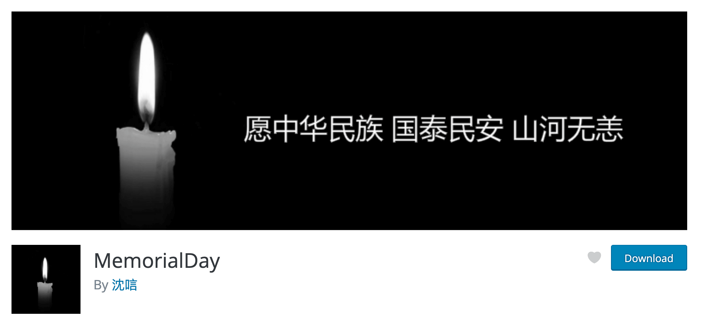

# MemorialDay

WordPress & Typecho 插件：「特殊节日使用」在国家公祭日、全国哀悼日时网站增加灰色滤镜。

## WordPress

### 安装

#### 后台安装(推荐使用)

WordPress 后台安装插件页面搜索：`MemorialDay`，安装由`沈唁`提供的插件即可。

<a href="https://wordpress.org/plugins/memorialday"></a>

#### 源码安装

从 GitHub 下载源码，通过 WordPress 后台上传安装，或者直接将源码上传到 WordPress 插件目录 `wp-content/plugins`，然后在后台启用

### 设置

默认日期为：`0404,0512,0918,1213`，可自行添加需要的日期

## Typecho

### 安装

1. 从 GitHub 下载源码，将源码上传到 Typecho 插件目录 `usr/plugins` 下

2. 修改插件文件名为`MemorialDay`

3. 修改目录权限和用户组

```bash
chown -R www:www MemorialDay/
chmod 755 MemorialDay/
```

4. 启用~

### 设置

默认日期为：`0404,0512,0918,1213`，可自行添加需要的日期

## 其他系统站点

其他系统站点可以直接添加代码给`header`中添加`css`样式

```css
html{filter: grayscale(100%); -webkit-filter: grayscale(100%); -moz-filter: grayscale(100%); -ms-filter: grayscale(100%); -o-filter: grayscale(100%); filter: url("data:image/svg+xml;utf8,#grayscale"); filter:progid:DXImageTransform.Microsoft.BasicImage(grayscale=1); -webkit-filter: grayscale(1);}
```
